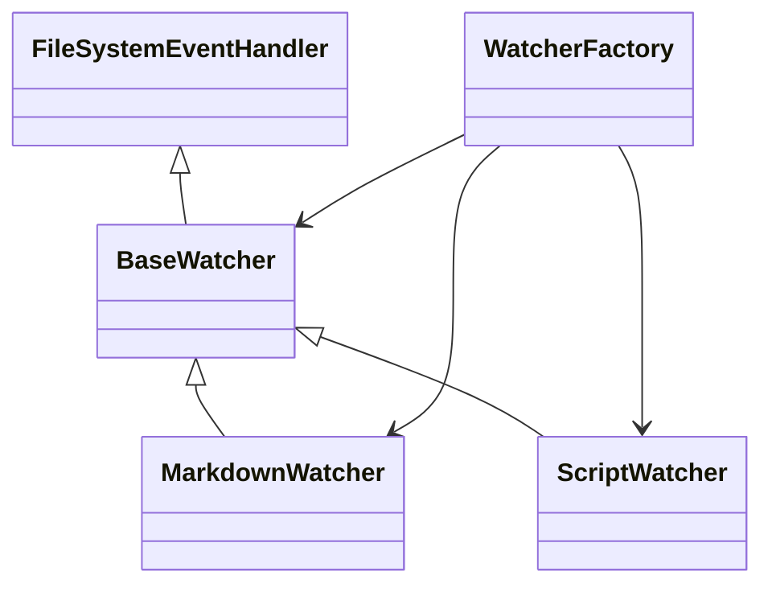
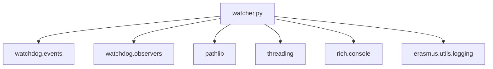
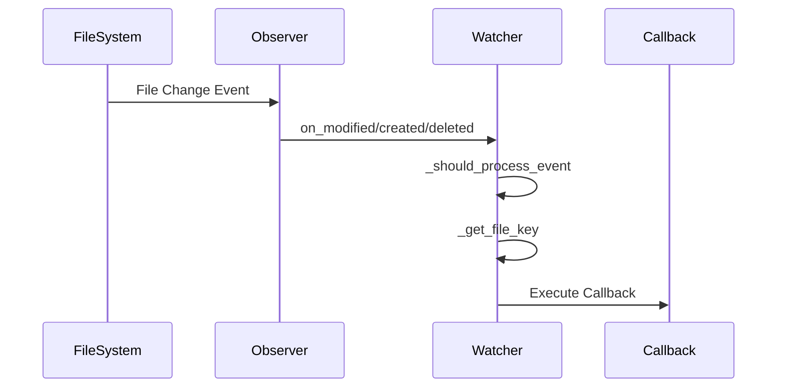

# Component Dependencies

## Class Hierarchy

## Module Dependencies

## File Watching Flow

## Component Relationships

### BaseWatcher

- **Inherits from**: `FileSystemEventHandler` (watchdog)
- **Used by**: `MarkdownWatcher`, `ScriptWatcher`
- **Dependencies**:
  - `watchdog.events.FileSystemEvent`
  - `watchdog.observers.Observer`
  - `pathlib.Path`
  - `threading.Lock`
  - `rich.console.Console`
  - `erasmus.utils.logging`

### MarkdownWatcher

- **Inherits from**: `BaseWatcher`
- **Used by**: `WatcherFactory`
- **Dependencies**:
  - All BaseWatcher dependencies
  - Git integration (implied)

### ScriptWatcher

- **Inherits from**: `BaseWatcher`
- **Used by**: `WatcherFactory`
- **Dependencies**:
  - All BaseWatcher dependencies
  - Python AST module

### WatcherFactory

- **Creates**: `BaseWatcher`, `MarkdownWatcher`, `ScriptWatcher`
- **Manages**: `Observer` instances
- **Dependencies**:
  - All watcher classes
  - `watchdog.observers.Observer`
