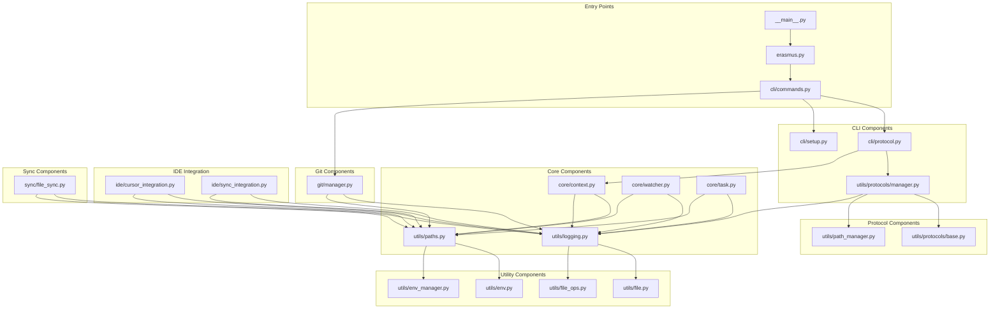

# Erasmus Dependency Graph

## Component Dependencies

## File Dependencies

### Entry Points

- `__main__.py`: Main entry point for the Erasmus package
- `erasmus.py`: Erasmus CLI entry point
- `cli/commands.py`: CLI interface for Erasmus

### Core Components

- `core/context.py`: Context management system
- `core/watcher.py`: File watching system
- `core/task.py`: Task management system

### CLI Components

- `cli/protocol.py`: Protocol management commands
- `cli/setup.py`: Project setup commands

### Git Components

- `git/manager.py`: Git repository management

### Protocol Components

- `utils/protocols/manager.py`: Protocol manager
- `utils/protocols/base.py`: Base protocol classes
- `utils/path_manager.py`: Path management for protocols

### Utility Components

- `utils/paths.py`: Path management
- `utils/logging.py`: Logging utilities
- `utils/env.py`: Environment utilities
- `utils/env_manager.py`: Environment management
- `utils/file.py`: File utilities
- `utils/file_ops.py`: File operations

### IDE Integration

- `ide/cursor_integration.py`: Cursor IDE integration
- `ide/sync_integration.py`: Sync IDE integration

### Sync Components

- `sync/file_sync.py`: File synchronization

## Key Dependencies

1. **Context Management**

   - Depends on path utilities and logging
   - Used by CLI commands and protocol management

2. **File Watching**

   - Depends on path utilities and logging
   - Used by CLI watch command

3. **Task Management**

   - Depends on path utilities and logging
   - Used by CLI task commands

4. **Git Management**

   - Depends on path utilities and logging
   - Used by CLI git commands

5. **Protocol Management**

   - Depends on path utilities, logging, and base protocol classes
   - Used by CLI protocol commands

6. **CLI Interface**
   - Depends on all other components
   - Provides the user interface for all functionality
