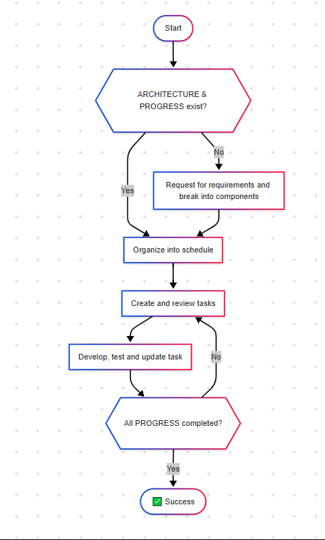

# Erasmus: AI Context Watcher for Development

## Overview
Erasmus is a powerful context watcher that enhances your development environment by tracking project state and providing intelligent assistance through AI integration. It's designed to work with cursor and windsurf IDEs to provide contextual guidance during development.

## How It Works

Erasmus leverages modern AI IDE capabilities by utilizing their rule injection mechanisms to deliver dynamic context to AI code assistants. The system maintains three core markdown documents that drive AI-assisted development:



### Intelligent Document Management

**.erasmus/architecture.md** serves as the project blueprint, defining goals and requirements that must be met for project completion.

**progress.md** tracks components derived from the architecture document, organizing them into a development schedule.

**tasks.md** breaks down components into manageable sub-tasks, tracking their completion status throughout development.

### Continuous Context Synchronization

As development progresses:
1. Erasmus monitors these files in real-time
2. When file changes are detected, it updates the IDE rule files
3. The AI assistant receives the updated context immediately
4. This allows the AI to maintain awareness of current project state

This continuous context loop ensures your AI assistant always has the most current understanding of your project status, decisions, and remaining work, enabling truly intelligent assistance throughout the development lifecycle.

## Quick Installation

```bash
curl -L https://raw.githubusercontent.com/bakobiibizo/erasmus/main/release/v0.0.1/erasmus_v0.0.1.sh -o erasmus.sh && chmod +x erasmus.sh && ./erasmus.sh
```

That's it! The installer will set up everything you need.

## What Does Erasmus Do?

Erasmus sits in the background of your development environment and:

1. **Tracks Project Context** - Maintains a complete view of your codebase structure, decisions, and progress
2. **Powers IDE Context Injection** - Feeds rich context to AI code assistants in compatible IDEs
3. **Monitors Development Files** - Watches for changes in key files like architecture docs and progress tracking
4. **Creates Essential Documentation** - Automatically generates and updates project documentation

### Core Files Managed by Erasmus

- **.erasmus/architecture.md** - Project architecture documentation
- **progress.md** - Development progress tracking
- **tasks.md** - Granular task management
- **.IDErules** - Bundled context for IDE integration

## Usage

### Basic Commands

```bash
# Start the context watcher
uv run erasmus.py --watch

# Set up a new project environment
uv run erasmus.py --setup [cursor|windsurf]

# View project status
uv run erasmus.py --status
```

### Advanced Usage

```bash
# Initialize a new project with specific IDE
uv run erasmus.py --init --ide cursor

# Update project documentation
uv run erasmus.py --update-docs

# Generate a new release
uv run erasmus.py --release

# Convert scripts for different platforms
uv run erasmus.py --convert-scripts
```

### Command Line Options

```bash
--watch              # Start the context watcher
--setup IDE          # Set up IDE environment (cursor/windsurf)
--status            # Show project status
--init              # Initialize new project
--ide IDE           # Specify IDE (cursor/windsurf)
--update-docs       # Update project documentation
--release           # Generate new release
--convert-scripts   # Convert scripts for different platforms
--version           # Show version information
--help              # Show help message
```

## Code Structure

### Core Components

1. **watcher.py** - Main application orchestrating project setup and management
   - `Watcher` class: Core functionality for file watching and context management
   - `Task` class: Task management and tracking
   - `TaskStatus` class: Task status enumeration

2. **src/script_converter.py** - Handles script conversion between platforms
   - `ScriptConverter` class: Converts shell scripts to batch scripts
   - Command mapping and function templates

3. **src/packager.py** - Python script packaging functionality
   - `ScriptPackager` class: Bundles multiple Python files into a single executable
   - AST-based code analysis and dependency tracking

4. **src/build_release.py** - Release package building
   - `build_single_file()`: Creates single-file executable
   - `embed_erasmus()`: Embeds executable into installer
   - `convert_to_batch()`: Converts shell scripts to batch files

### Key Classes and Methods

#### Watcher Class
```python
class Watcher:
    def __init__(self, base_path: Path):
        self.base_path = Path(base_path)
        self.tasks = []
        self.context = {}

    def watch_files(self):
        """Start watching project files for changes."""
        
    def update_context(self):
        """Update project context based on file changes."""
        
    def add_task(self, description: str) -> Task:
        """Add a new task to the project."""
```

#### Task Class
```python
class Task:
    def __init__(self, id: str, description: str):
        self.id = id
        self.description = description
        self.status = TaskStatus.PENDING
        self.notes = []

    def add_note_to_task(self, note: str):
        """Add a note to the task."""
```

#### ScriptPackager Class
```python
class ScriptPackager:
    def __init__(self, base_path: Path):
        self.base_path = Path(base_path)
        self.import_set = set()
        self.script_bodies = []

    def package_scripts(self, output_path: Optional[Path] = None) -> str:
        """Package all scripts into a single file."""
```

## Compatible IDE Environments

- **cursor** - Full support with `.cursorrules` integration
- **windsurf** - Full support with `.windsurfrules` integration

## Advanced Features

- **Atomic Git Management** - Provides structured commit messages with contextual awareness
- **Cross-Platform Support** - Works on Windows, macOS, and Linux
- **Local LLM Integration** - Can be configured to use local AI models instead of OpenAI

## Configuration

Erasmus can be configured through:

1. `.env` file (created during installation)
2. Command-line parameters
3. Interactive prompts

Key configuration variables:

```
IDE_ENV=cursor        # Your IDE environment
OPENAI_API_KEY=       # Your OpenAI API key
OPENAI_MODEL=gpt-4    # Model to use for git commit messages
```

## Development

### Setting Up Development Environment

```bash
# Clone the repository
git clone https://github.com/bakobiibizo/erasmus.git
cd erasmus

# Create virtual environment
uv venv

# Activate virtual environment
source .venv/bin/activate  # Unix
.venv\Scripts\activate     # Windows

# Install dependencies
uv pip install -e .[test]
```

### Running Tests

```bash
# Run all tests
uv run pytest

# Run specific test file
uv run pytest tests/test_packager.py

# Run tests with coverage
uv run pytest --cov=src
```

### Building a Release

```bash
# Build the complete release package
python main.py build

# Test the installer in Docker
python main.py test
```

## Troubleshooting

- **Permission Issues**: Run `sudo chmod +x erasmus.sh` if you encounter permission denied errors
- **OpenAI Integration**: Ensure you have valid API credentials in your `.env` file
- **Path Issues**: If `uv` is not found, try restarting your terminal or adding it to your PATH
- **Script Conversion**: If script conversion fails, check the release directory permissions
- **Package Building**: Ensure all required files exist in the correct locations before building

## Contributing

Please see [CONTRIBUTING.md](CONTRIBUTING.md) for guidelines on contributing to Erasmus.