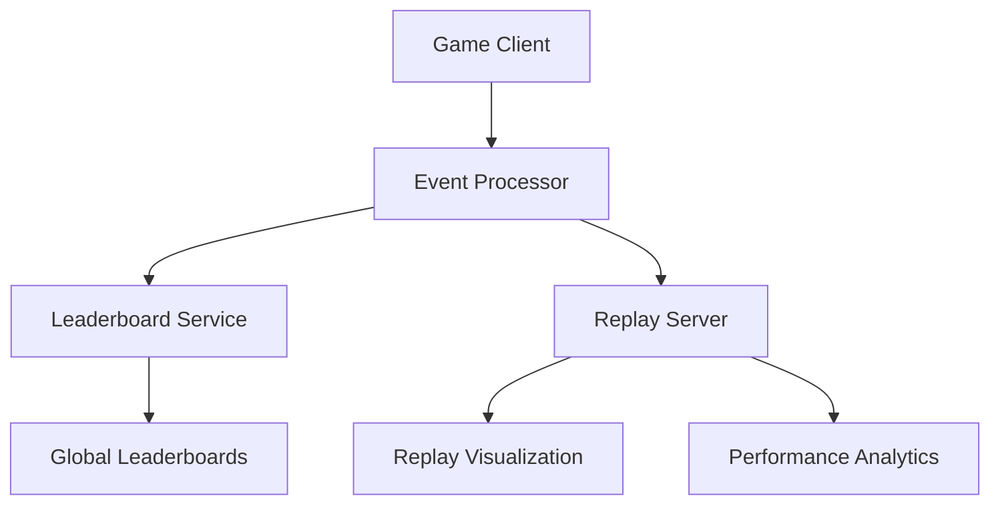

# GameSync: Real-time Multiplayer Game Leaderboard and Replay System

## Project Overview

GameSync is an interactive platform for tracking, visualizing, and sharing game performance across multiple players and game modes. It provides real-time leaderboards, performance analytics, and game replay capabilities.

## System Architecture

### 1. Components

#### 1.1 Game Client (Python/Pygame)
- Lightweight 2D multiplayer game
- Captures player actions and game events
- Sends performance metrics to central server
- Supports multiple game modes

#### 1.2 Event Processor (Rust)
- High-performance event parsing
- Validates and normalizes game events
- Implements anti-cheat mechanisms
- Prepares data for leaderboard and replay systems

#### 1.3 Leaderboard Service (Go)
- Real-time player ranking
- Supports global and mode-specific leaderboards
- Implements ELO-like rating system
- Provides fast query interfaces

#### 1.4 Replay & Visualization Server (TypeScript/React)
- Interactive game replay system
- 3D visualization of game events
- Performance heatmaps
- Shareable replay links

#### 1.5 Replay Analytics (Python)
- Generate performance insights
- Create visual game summaries
- Highlight key moments and strategies

### 2. Workflow

### 3. Key Challenges

1. **Real-time Processing**: Handle game events with minimal latency
2. **Data Integrity**: Ensure accurate event recording
3. **Performance Visualization**: Create engaging replay experiences
4. **Scalability**: Support multiple concurrent games and players

### 4. Technology Stack

- **Game Client**: Python, Pygame
- **Event Processor**: Rust, nom parsing
- **Leaderboard**: Go, Redis
- **Replay Server**: TypeScript, React, Three.js
- **Analytics**: Python, Pandas

### 5. Development Phases

1. Game Mechanics Implementation
2. Event Capture and Processing
3. Leaderboard System
4. Replay Visualization
5. Performance Analytics

### 6. Deployment Considerations

- Docker containerization
- Kubernetes scaling
- WebSocket for real-time updates

### 7. Monitoring and Observability

- Comprehensive event logging
- Performance metrics
- User engagement tracking

## Erasmus Integration

Erasmus will manage:
- Task tracking across game development
- Context synchronization between components
- Configuration management
- Development workflow coordination

### Example tasks

1. Implement core game mechanics
2. Design leaderboard ranking algorithm
3. Create replay visualization system
4. Develop anti-cheat mechanisms
5. Optimize event processing performance

## Conclusion

GameSync demonstrates a complex, multi-component game system that requires sophisticated context management, making it an ideal showcase for Erasmus's capabilities.
