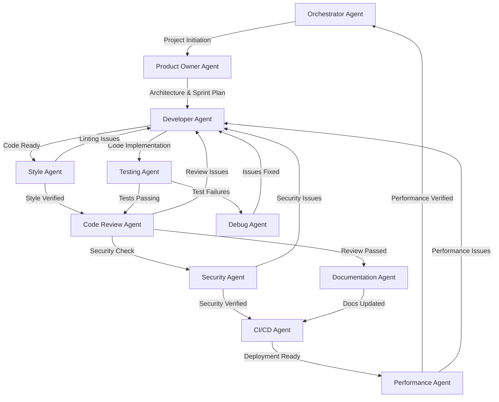

# Agent Workflow and Dependency Map

## Development Process Flow

## Agent Responsibilities and Handoffs

### 1. Orchestrator Agent
- **Initiates**: Project workflows and agent coordination
- **Receives from**: Performance Agent (final verification)
- **Hands off to**: Product Owner Agent (project initiation)

### 2. Product Owner Agent
- **Initiates**: Project planning and requirements definition
- **Receives from**: Orchestrator Agent (project initiation)
- **Hands off to**: Developer Agent (architecture and sprint plan)
- **Produces**: `.erasmus/architecture.md`, `progress.md`

### 3. Developer Agent
- **Initiates**: Code implementation and task breakdown
- **Receives from**: Product Owner Agent (architecture and sprint plan)
- **Hands off to**: Testing Agent, Style Agent (code ready for verification)
- **Produces**: `tasks.md`, implementation code

### 4. Testing Agent
- **Initiates**: Test creation and execution
- **Receives from**: Developer Agent (code to test)
- **Hands off to**: Code Review Agent (tests passing) or Debug Agent (test failures)
- **Produces**: Test files, test results

### 5. Style Agent
- **Initiates**: Code style and quality verification
- **Receives from**: Developer Agent (code to analyze)
- **Hands off to**: Code Review Agent (style verified) or Developer Agent (linting issues)
- **Produces**: Style reports, linting fixes

### 6. Code Review Agent
- **Initiates**: Code quality assessment
- **Receives from**: Testing Agent, Style Agent (verified code)
- **Hands off to**: Documentation Agent, Security Agent (review passed) or Developer Agent (review issues)
- **Produces**: Review comments, approval

### 7. Security Agent
- **Initiates**: Security vulnerability scanning
- **Receives from**: Code Review Agent (code to scan)
- **Hands off to**: CI/CD Agent (security verified) or Developer Agent (security issues)
- **Produces**: Security reports, vulnerability fixes

### 8. Documentation Agent
- **Initiates**: Documentation updates
- **Receives from**: Code Review Agent (code to document)
- **Hands off to**: CI/CD Agent (docs updated)
- **Produces**: README, API docs, inline comments

### 9. CI/CD Agent
- **Initiates**: Build and deployment processes
- **Receives from**: Security Agent, Documentation Agent (verified code and docs)
- **Hands off to**: Performance Agent (deployment ready)
- **Produces**: Build artifacts, deployment configurations

### 10. Performance Agent
- **Initiates**: Performance testing and optimization
- **Receives from**: CI/CD Agent (deployed code)
- **Hands off to**: Orchestrator Agent (performance verified) or Developer Agent (performance issues)
- **Produces**: Performance reports, optimization recommendations

### 11. Debug Agent
- **Initiates**: Issue diagnosis and resolution
- **Receives from**: Testing Agent (test failures)
- **Hands off to**: Developer Agent (issues identified)
- **Produces**: Debug reports, fix recommendations

## Workflow Triggers

1. **New Project**: Orchestrator → Product Owner
2. **Architecture Complete**: Product Owner → Developer
3. **Code Ready**: Developer → Testing + Style Agent
4. **Verification Complete**: Testing + Style Agent → Code Review
5. **Review Passed**: Code Review → Documentation + Security
6. **Documentation & Security Verified**: Documentation + Security → CI/CD
7. **Deployment Ready**: CI/CD → Performance
8. **Performance Verified**: Performance → Orchestrator (cycle complete)

## Error Handling Paths

1. **Test Failures**: Testing → Debug → Developer
2. **Linting Issues**: Style Agent → Developer
3. **Review Issues**: Code Review → Developer
4. **Security Vulnerabilities**: Security → Developer
5. **Performance Problems**: Performance → Developer
