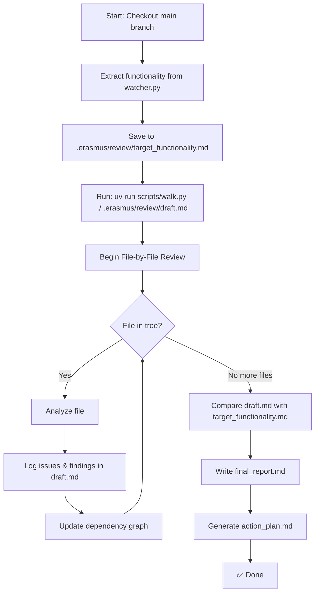

### 🧠 Codebase Review

You're tasked with a **comprehensive, structured codebase review**, performed one file at a time, to track progress and align the implementation with expected functionality.

#### 🎯 Objectives

1. **Extract Functionality from `watcher.py`** (on `main` branch)

   - Record its intended functionality in: `.erasmus/review/target_functionality.md`

2. **Generate Directory Structure**

   - Use `uv run scripts/walk.py ./ .erasmus/review/draft.md` to create a full directory tree of the project.
   - This tree becomes your **review checklist** — check off files as you complete them.

3. **Perform a File-by-File Review**

- For each file:
  - errors
  - missing functionality
  - dead code
  - repeated code or functionality
- Record notes inline in `.erasmus/review/draft.md` under that file's entry

1. **Build a Dependency Graph**

   - Record all imports and usage relationships in the codebase
   - Output to `.erasmus/review/dependencies.md`

2. **Final Comparison**

   - Compare `.erasmus/review/draft.md` (what’s implemented) with `.erasmus/review/target_functionality.md` (what should be implemented)
   - Highlight:
     - Features present and missing
     - Redundancies or inefficiencies
     - Misalignments in architecture or functionality

3. **Write the Final Report**

   - Summarize findings in `.erasmus/review/final_report.md`
     - What’s working and what’s broken
     - Deviations from the intended functionality
     - Areas for refactoring
     - High-priority and low-priority issues

4. **Propose an Action Plan**
   - Output a task list in `.erasmus/review/action_plan.md`
     - Organized into phases or sprints
     - Assignable and traceable tasks
     - Include suggestions for testing and documentation

---

### ⚙️ One-File-at-a-Time Review Workflow

---

### 📝 Execution Notes

- **One file at a time only**: never batch process unless comparing in the final report
- Record **inline notes per file** in `draft.md`
- Use **clear headings** per file
- Reuse parsed file relationships in `dependencies.md`
- Use Markdown formatting in all review artifacts
- Maintain consistent formatting and audit trails across review files
